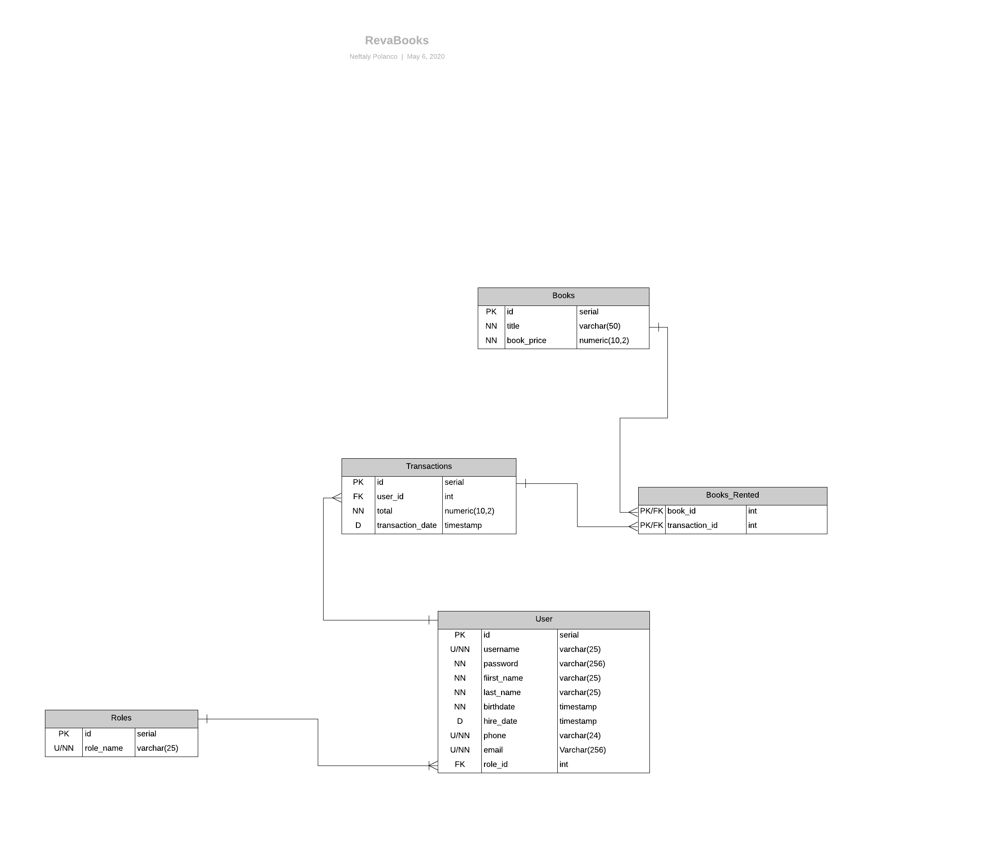

# Project 0

For Project 0, you will be building a RESTful API using TypeScript and Express. Associates are allowed to come up with their own API idea, but it must be approved by the trainer; suggested ideas are provided below.

Suggestions: 
- resource management system API
- learning management system API
- any kind of social media API
- mobile banking application API

## Features
- [ ] RESTful API (At least Level 2 of the [Richardson Maturity Model](https://martinfowler.com/articles/richardsonMaturityModel.html))
- [ ] Documentation (all methods have basic documentation)
- [ ] Unit testing (>= 80% coverage)
- [ ] SQL Data Persistance (at least 3 tables; all 3NF)
- [ ] Logging (extra)
- [ ] Authentication/Authorization (extra)
                                                
                                                      My Project 0
A simple bookstore persisting Customers, Books, Employees and Authors. The end points of the database are Books, Customers, Employees and Authors.
Employees, mostly librarians manage the database. There will be an admin in charge of all employees. Only the admin can access all employees info. employees can search the database for books in stock and price. Employees are also able to query the database for information about who wrote the book, the genre of the book, who has bought the book, how many books remain in stock. Who has bought the book and who has sold the book.

